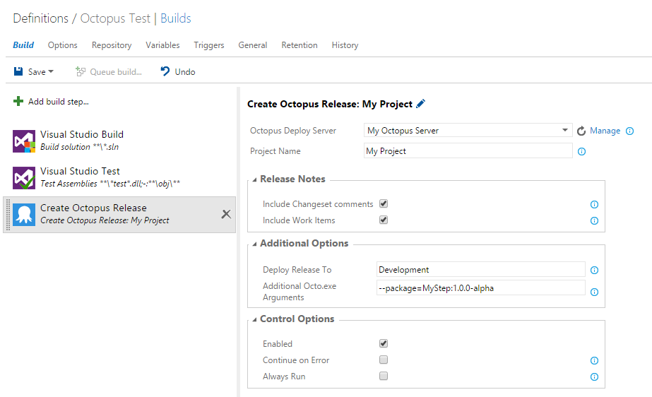

Team Build Custom Steps
=======================

Custom Build Steps for [Team Build](https://www.visualstudio.com/en-us/get-started/build/build-your-app-vs)

*Note: You can still use [OctoPack](http://docs.octopusdeploy.com/display/OD/Using+OctoPack) as part of your MSBuild task to package and push Nuget packages.*

[Create Octopus Release](CreateOctopusRelease)
----------------------
Creates a new Release in Octopus Deploy.

### Instructions for use

If you'd like to install from code, detailed installation instructions can be found at [http://docs.octopusdeploy.com/display/OD/Use+the+Team+Foundation+Build+Custom+Task](http://docs.octopusdeploy.com/display/OD/Use+the+Team+Foundation+Build+Custom+Task)

Before starting, configure a "Generic" connected service in the administration section for your project.

Use "octopus" for the User name and your Octopus API Key for the Password/Token Key setting.

There are a number of configuration options available.

 
 
 Options include:
 * **Octopus Deploy Server**:  Dropdown for selecting your Octopus Server (step 1)
 * **Project Name**:  The name of the project to create a release for
 * **Include Changeset comments**:  Whether to include changeset comments in the release notes
 * **Include Work Items**:  Whether to include work item titles in the release notes
 * **Deploy Release To**:  Optional environment to automatically deploy to (uses the [`--deployTo` argument in octo.exe](http://docs.octopusdeploy.com/display/OD/Creating+releases))
 * **Additional Octo.exe Arguments**:  Any additional [Octo.exe arguments](http://docs.octopusdeploy.com/display/OD/Creating+releases) to include
 
### Release Notes:

The *Release Notes* options, if selected, will result in nicely formatted release notes with deep links to Team Foundation Server or Visual Studio Online.

